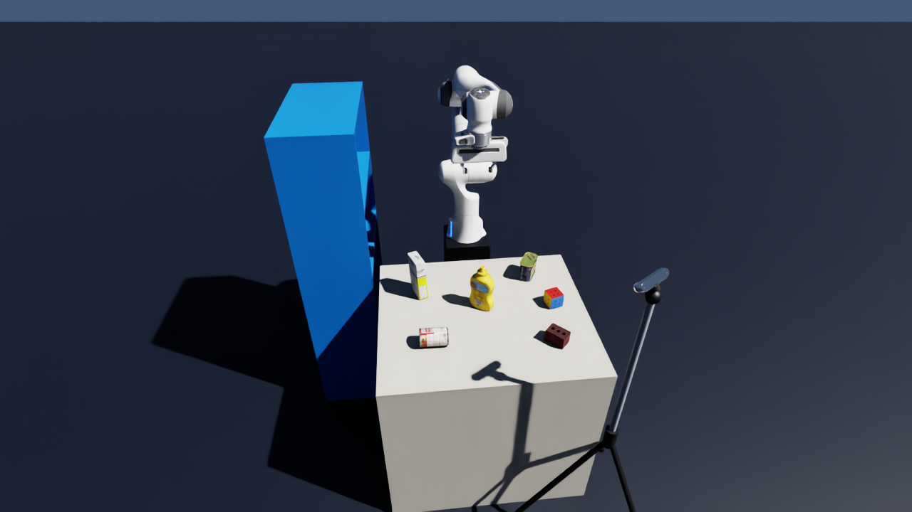
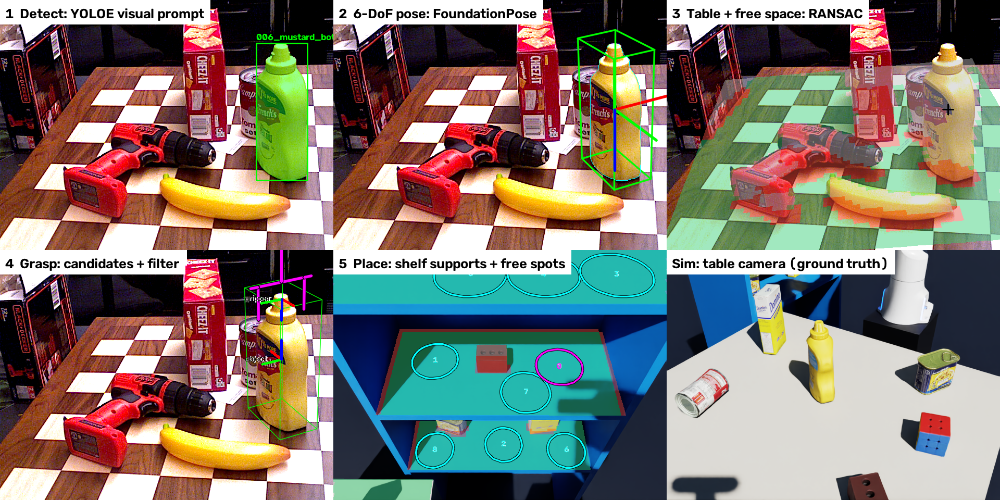

# prompt-pick-place

**Vision-driven pick-and-place from a prompt.** Show the robot one example image (or type a phrase), and it
finds that object on the table, estimates its 6-DoF pose, plans a grasp, and finds free space on a shelf to
put it — with no object-specific training and no prior model of the shelf.



*Simulated cell (Isaac Sim 6.1): Franka Panda, a table of YCB objects, a three-level shelf as the place target,
a fixed RealSense D455 over the table, and a wrist-mounted D455 that looks into the shelf.*

## Pipeline

| # | Stage | Question it answers | Method | Status |
|---|---|---|---|---|
| 1 | **Detect** | Where is the object I was shown? | YOLOE-seg, visual or text prompt → box + mask | ✅ Built |
| 2 | **Pose** | What is its exact 6-DoF pose? | FoundationPose (model-based, mask-initialised) | ✅ Built |
| 3 | **Table** | Where is the table, and what is free? | RANSAC plane + occupancy grid | ✅ Built |
| 4 | **Grasp** | How should the gripper take it? | Parallel-jaw candidates + tilt / table / collision filter | ✅ Built |
| 5 | **Place** | Where on the shelf does it fit? | Sequential RANSAC for horizontal supports + free-space search | ✅ Built |
| — | **Execute** | Move the robot | ROS 2 Jazzy · MoveIt 2 · BehaviorTree.CPP · ros2_control in Isaac Sim | ✅ Built |



```
fixed camera ─► 1 Detect ─► 2 Pose ──┐
fixed camera ─► 3 Table ─────────────┴─► 4 Grasp ──┐
wrist camera ─► 5 Place ───────────────────────────┴─► grasp + placement chosen together ─► pick ─► place
                (the arm looks at the shelf before it picks)
```

In ROS 2 each stage is a node (stage 2 is Isaac ROS FoundationPose in Docker, stage 3 and the RANSAC of stage 5 are
C++); a BehaviorTree.CPP task manager sequences them and moves the Panda through MoveIt 2 and ros2_control running
inside Isaac Sim. Guide: [docs/ROS.md](docs/ROS.md).

## Results

| Stage | Measured |
|---|---|
| 1 Detect | Mustard bottle found from one example image, score 0.55, no false positives among 5 objects · ~17 ms / frame (L40S) |
| 2 Pose | Sim, vs. ground truth: **0.5–1.5°, < 1 mm** (upright bottle and a can lying on its side) · ~0.9 s / registration |
| 3 Table | Table plane from 52 % of the points; recovered bottle height 92 mm vs. 96 mm true (pose and plane agree) |
| 4 Grasp | 2 of 8 candidates feasible; best approaches 2° from vertical |
| 5 Place | All three shelf levels found at their true heights (0.00 / 0.32 / 0.64 m) · 9 placements ranked by clearance · 0.15 s |

Stage-by-stage details, numbers and failure cases are in each guide below.

## Quick start

Tested on Ubuntu 24.04, NVIDIA L40S, driver 580.

```bash
python3 -m venv .venv && .venv/bin/pip install -r requirements.txt      # vision (stages 1, 3–5)
docker start foundationpose                                             # stage 2 (FoundationPose + CUDA extensions)
```

Each stage has a playground: one command, a printed report, and an annotated image in `output/`.

```bash
source .venv/bin/activate
python pipeline/interactive_detect.py --ref 006_mustard_bottle     # 1 detect
python pipeline/interactive_pose.py                                 # 2 pose (runs itself in the container)
python pipeline/interactive_spatial.py                              # 3 table + free space
python pipeline/interactive_grasp.py                                # 4 grasp
python pipeline/interactive_place.py                                # 5 place (needs the sim capture below)
.venv-sim/bin/python sim/scene.py                                   # Isaac Sim: RGB-D + ground truth -> data/sim/
```

The whole robot, in three terminals (setup: [docs/ROS.md](docs/ROS.md)):

```bash
.venv-sim/bin/python sim/ros_cell.py                                                  # Isaac Sim over ROS 2
source ros2/install/setup.bash && ros2 launch ppp_bringup all.launch.py eval:=true    # robot, MoveIt, perception
source ros2/install/setup.bash && ros2 launch ppp_bringup task.launch.py              # pick both targets -> shelf
```

Full setup (FoundationPose container, Isaac Sim venv): [docs/SIM.md](docs/SIM.md) and the stage guides.

## Documentation

| Guide | Covers |
|---|---|
| [Stage 1 — Detect](docs/STAGE1_DETECT.md) | Text / visual / prompt-free YOLOE, knobs, how the YOLOE head works |
| [Stage 2 — Pose](docs/STAGE2_POSE.md) | FoundationPose hypotheses, refiner, scorer; mesh renderer |
| [Stage 3 — Table](docs/STAGE3_SPATIAL.md) | RANSAC, table frame, occupancy grid |
| [Stage 4 — Grasp](docs/STAGE4_GRASP.md) | Candidates, filter, object and gripper poses in every frame |
| [Stage 5 — Place](docs/STAGE5_PLACE.md) | Shelf supports, headroom, placement candidates |
| [Simulation](docs/SIM.md) | Isaac Sim cell, cameras, datasets, livestream |
| [ROS 2 pipeline](docs/ROS.md) | Nodes, behavior tree, MoveIt, FoundationPose container, episodes |
| [Decisions & issues](docs/DECISIONS.md) | Why things are the way they are, known issues, roadmap |

## Repository

| Path | Contents |
|---|---|
| `vision/` | The algorithms: `detect`, `pose`, `spatial`, `grasp`, `place`, `transforms` |
| `pipeline/` | Stage playgrounds (`interactive_*.py`) and the scripted mustard0 run |
| `sim/` | Isaac Sim cell (`cell.py`): dataset capture (`scene.py`), live over ROS 2 (`ros_cell.py`), episodes |
| `ros2/src/` | ROS 2 packages: `ppp_interfaces`, `ppp_geometry` (C++ RANSAC + pybind11), `ppp_spatial`, `ppp_perception`, `ppp_task` (behavior tree), `ppp_bringup` |
| `docker/` | Isaac ROS 4.5 FoundationPose image + start script |
| `config.yaml` | Every tunable parameter, per stage and for the sim |
| `data/` | Multi-object RGB-D scene (BOP YCB-Video) + reference crops; sim captures (generated) |
| `docs/` | Stage guides, sim guide, decision log, figures |
| `tests/` | Unit tests for `vision/` + C++/numpy RANSAC equivalence (`pytest`, no GPU) |

## Roadmap

| Phase | Goal | Status |
|---|---|---|
| 0 · Environment | ROS 2 Jazzy workspace, MoveIt 2, Isaac ROS 4.5 FoundationPose | ✅ |
| 1 · Sim ↔ ROS | Cameras, clock and ros2_control from Isaac Sim over ROS 2 | ✅ |
| 2 · Motion | MoveIt reaches both pick targets and the shelf | ✅ |
| 3 · Perception nodes | One node per stage; shared C++ RANSAC for stages 3 and 5 | ✅ |
| 4 · Task | Behavior tree: look at the shelf → pick from the table → place | ✅ |
| 5 · Robustness | Hand-eye calibration, sensor noise, regrasp, success rate over randomised episodes | 🗺️ Baseline measured |

Details and rationale: [docs/DECISIONS.md](docs/DECISIONS.md).
