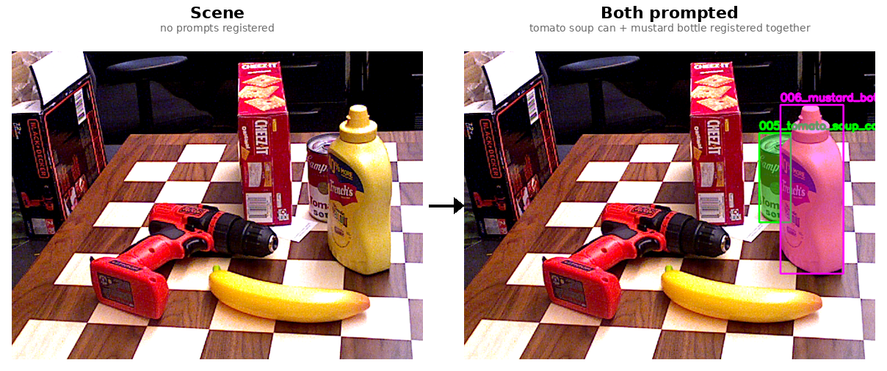
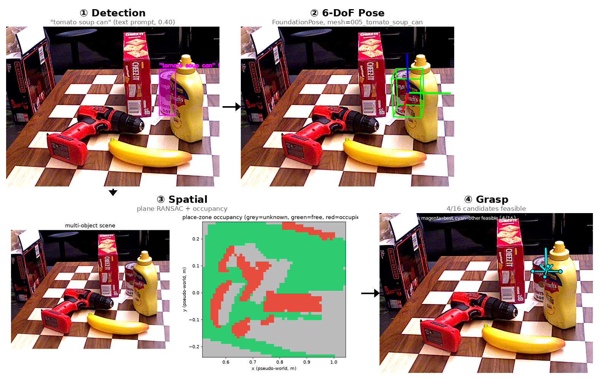
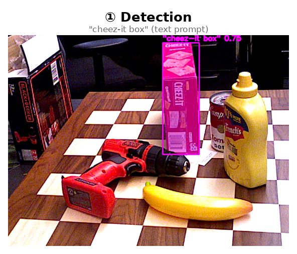
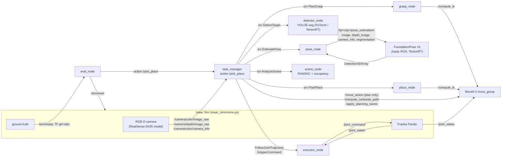

# prompt-pick-place

Visual-prompt pick-and-place in Isaac Sim + ROS 2: YOLOE detection, FoundationPose 6-DoF pose,
grasp & placement planning, TensorRT, and automated evaluation.

Show the robot **one example image** of an object. It finds that object on a cluttered table
(simulated RealSense RGB-D), estimates its 6-DoF pose, picks it with a Franka Panda and puts it
down in a free spot of a cluttered placement area. Everything runs in Isaac Sim + ROS 2 Humble;
every run can be scored automatically against simulator ground truth.

> Demo video / figures: `results/` (filled in from the GPU runs — see [Results](#results)).

## Status

Two different things live in this repo, and it matters which one you're looking at:

| | What it is | Has it actually been run? |
|---|---|---|
| **Bare-metal vision pipeline** | Stages ①–④'s core algorithms, driven by standalone Python scripts, no ROS/Isaac Sim/MoveIt | **Yes** — verified end-to-end on a real RGB-D frame, see [Bare-metal vision pipeline (debugging tool)](#bare-metal-vision-pipeline-debugging-tool) |
| **Full ROS 2 / Isaac Sim pipeline** | Stages ①–⑦ as ROS 2 nodes (below), Isaac Sim, Isaac ROS's TensorRT FoundationPose, MoveIt 2, the evaluation harness | **No** — code is written (see [Pipeline](#pipeline) and [Architecture](#architecture-ros-2-data-path)) but Isaac Sim is not installed on the current dev machine and the container in `docker/Dockerfile.ppp` targets ROS 2 Humble, not the Jazzy install on this box. Treat everything from [Architecture](#architecture-ros-2-data-path) onward ([Perception spec](#perception-spec), [Evaluation](#evaluation), [Results](#results)) as the **design/target**, not a report of a run that happened |

The bare-metal pipeline exists specifically to validate the vision algorithms (detection → pose →
spatial reasoning → grasp geometry) in isolation, with visible intermediate output at every stage,
before paying the cost of standing up the full simulator + robot stack.

## Pipeline

| # | Stage | What it does | Status | Code |
|---|---|---|---|---|
| ① | Target detection from a visual prompt | One reference image + a box around the object in it → YOLOE-seg registers that crop as a one-shot "visual-prompt embedding" (class) → a single forward pass on the scene image returns a 2D box, confidence, and pixel mask for every registered object | ✅ core verified bare-metal | [`detector_node`](ros2/ppp_perception/ppp_perception/detector_node.py), [`yoloe_prompt`](ros2/ppp_perception/ppp_perception/yoloe_prompt.py) |
| ② | 6-DoF pose | RGB + depth + stage ①'s mask + the object's textured YCB mesh → FoundationPose (render-and-compare pose refinement + scoring, TensorRT) → the object's full 6-DoF pose (position + orientation) relative to the camera | ✅ core verified bare-metal (via FoundationPose's own reference implementation, not yet via Isaac ROS's node — see caveat below) | [`pose_node`](ros2/ppp_perception/ppp_perception/pose_node.py), [`foundationpose.launch.py`](ros2/ppp_bringup/launch/foundationpose.launch.py) |
| ③ | Spatial perception | Depth + intrinsics → 3D point cloud → RANSAC isolates the table plane (gives table height, used as a hard constraint downstream) → points above the plane are rasterized into a place-zone occupancy grid (free / occupied / unobserved per cell) | ✅ core verified bare-metal | [`scene_node`](ros2/ppp_perception/ppp_perception/scene_node.py), [`plane`](ros2/ppp_perception/ppp_perception/core/plane.py), [`free_space`](ros2/ppp_perception/ppp_perception/core/free_space.py) |
| ④ | Grasp pose | The mesh's bounding box → analytic parallel-jaw candidates through each of its 6 faces (both closing axes, both signs), generated purely in the object's own frame → placed in the world using stage ②'s pose → **geometric filter** (approach ≤ 50° from straight-down, fingertips clear stage ③'s table height with margin) → **IK-reachability filter** (MoveIt: both pre-grasp and grasp pose must have a valid, mutually-close IK solution) → lowest-tilt / least-arm-motion survivor wins | ⚠️ core verified bare-metal *up to the geometric filter only* — no MoveIt/IK filter yet (no robot description wired up) | [`grasp_node`](ros2/ppp_manipulation/ppp_manipulation/grasp_node.py), [`grasp`](ros2/ppp_manipulation/ppp_manipulation/core/grasp.py) |
| ⑤ | Placement | Clearance map of the place zone (from ③'s occupancy grid) ≥ object footprint radius + margin → candidate spot nearest the zone centre → yaw candidates → IK check | 📝 designed, not run | [`place_node`](ros2/ppp_manipulation/ppp_manipulation/place_node.py), [`place`](ros2/ppp_manipulation/ppp_manipulation/core/place.py) |
| ⑥ | Task execution | MoveIt 2 (OMPL joint-space + Cartesian approach/lift/descend) → trajectory executor → Isaac Sim | 📝 designed, not run | [`task_manager`](ros2/ppp_manipulation/ppp_manipulation/task_manager.py), [`executor_node`](ros2/ppp_manipulation/ppp_manipulation/executor_node.py) |
| ⑦ | Evaluation | Randomized episodes, scored against simulator ground truth; latency per stage | 📝 designed, not run | [`eval_node`](ros2/ppp_eval/ppp_eval/eval_node.py), [`metrics`](ros2/ppp_eval/ppp_eval/core/metrics.py) |

The perception results feed the task directly: the RANSAC table height becomes the MoveIt collision
table and the grasp/placement height reference; the occupancy grid drives placement; the estimated
pose defines grasp and the object's pose after placement.

**Caveat on ②'s "verified" claim:** the bare-metal demo uses NVIDIA's own FoundationPose reference
implementation (run via Docker — see below), which is the same pose-estimation algorithm but not the
same *code path* as `pose_node.py`, which specifically bridges to Isaac ROS's TensorRT-wrapped
`isaac_ros_foundationpose` node over ROS topics. The algorithm is validated; the ROS bridge is not yet.

## Bare-metal vision pipeline (debugging tool)

`perception_demo/pipeline_demo/` runs stages ①–④'s real core logic (the same `core/*.py` modules the
ROS nodes import) as four standalone scripts, chained on one real RGB-D frame, with **no ROS 2, no
Isaac Sim, no MoveIt**. Each stage saves a visible intermediate result to
`perception_demo/pipeline_demo/output/` — a debugging tool for the vision half of the pipeline,
independent of whether the simulator/robot stack is set up.

Input data: NVIDIA's own `mustard0` RGB-D sequence (bundled with FoundationPose's demo data), not
this repo's `assets/ycb` scans — see the limitations below for why.

### Setup (one-time)

Tested on Ubuntu 24.04, Python 3.12, an NVIDIA L40S (46GB) with driver ≥ 580 (CUDA 13-capable — the
FoundationPose image below targets an older CUDA 12.1 toolkit internally, which is fine, the driver is
backward compatible), and Docker already installed. No ROS 2, no Isaac Sim, no GPU needed on the host
side (stages ③/④ are pure numpy/opencv/matplotlib) — the GPU is only used inside the FoundationPose
container for stages ①/②.

**1. Host-side Python env** (for stages ③/④, run directly with the host's Python — no ROS/colcon
build needed since `ppp_common`/`ppp_perception.core`/`ppp_manipulation.core` are plain Python modules):

```bash
python3 -m venv .venv
.venv/bin/pip install --upgrade pip
.venv/bin/pip install numpy opencv-python-headless matplotlib pyyaml
```

**2. FoundationPose, as a Docker image** (for stages ①/②; the `ultralytics`/`torch`/`opencv` YOLOE
detection dependencies for stage ① also live inside this same container, so nothing extra to install
for ① beyond this):

```bash
git clone https://github.com/NVlabs/FoundationPose third_party/FoundationPose
cd third_party/FoundationPose
```

Follow that repo's own README for the Docker path — in short: pull/build their image (on GPUs newer
than what their own `Dockerfile` targets, e.g. Ada/L40S-class, use the community image
`shingarey/foundationpose_custom_cuda121:latest` instead, per their README's note on newer GPUs), run
their `build_all.sh` inside the container to build the `mycpp` extension and kaolin against your
torch/CUDA, then run their `download_models.sh` / follow their Drive links to fetch pretrained weights
and the bundled `demo_data` (includes the `mustard0` sequence this bare-metal pipeline runs on). Name
the resulting long-running container `foundationpose` (`docker run -d --name foundationpose ...`), so
the commands below match:

```bash
docker start foundationpose   # after the one-time build above, this is all you need to resume it
```

No `assets/ycb` prep needed for this specific demo — it runs entirely on FoundationPose's own bundled
`mustard0` data (see the limitations below for why `assets/ycb` isn't used here yet).

### Run, in order

The container's torch/ultralytics/cv2 live in a conda env named `my` (`/opt/conda/envs/my`), not the
system Python — `docker exec ... bash -lc` does **not** auto-activate it, so call that env's Python
directly rather than plain `python3` (which resolves to the system interpreter and has none of these
packages):

```bash
docker start foundationpose

# ① detection: YOLOE-seg visual-prompt box+mask (runs inside the container: torch/ultralytics live there)
docker exec -it foundationpose bash -lc \
  'cd /home/ai/workspace/prompt-pick-place && /opt/conda/envs/my/bin/python3 perception_demo/pipeline_demo/01_detect.py'

# ② pose: FoundationPose registration using stage ①'s mask (not the dataset's ground-truth mask)
cp perception_demo/pipeline_demo/02_pose.py third_party/FoundationPose/02_pose.py
docker exec -it foundationpose bash -lc \
  'cd /home/ai/workspace/prompt-pick-place/third_party/FoundationPose && /opt/conda/envs/my/bin/python3 02_pose.py'

# ③ spatial: table-plane RANSAC + place-zone occupancy grid (pure numpy — runs on the host)
.venv/bin/python perception_demo/pipeline_demo/03_spatial.py

# ④ grasp: box-face candidates -> geometric filter (pure numpy — runs on the host)
.venv/bin/python perception_demo/pipeline_demo/04_grasp.py

docker stop foundationpose   # frees the GPU when you're done
```

### Output


| # | File | Shows |
|---|---|---|
| ① | [`01_detection.png`](docs/pipeline_demo/01_detection.png) (+ `01_mask.png`) | YOLOE box + mask overlaid on the scene frame — `006_mustard_bottle 0.51` |
| ② | [`02_pose_overlay.png`](docs/pipeline_demo/02_pose_overlay.png) (+ `02_pose_ob_in_cam.txt`) | FoundationPose's estimated 6-DoF pose (RGB/axes + 3D box overlay; raw 4×4 matrix) |
| ③ | [`03_occupancy.png`](docs/pipeline_demo/03_occupancy.png) (+ `03_T_world_cam.txt`) | Table-plane RANSAC inliers/outliers + the free (green) / occupied (red) / unobserved (grey) place-zone grid |
| ④ | [`04_grasp_candidates.png`](docs/pipeline_demo/04_grasp_candidates.png) (+ `04_result.json`) | All 8 box-face candidates ranked by tilt; 2/8 pass the geometric filter, best (8.5° tilt, top-down through the cap) in green |

Full-resolution copies of these four plus the composite above are tracked in
[`docs/pipeline_demo/`](docs/pipeline_demo/) so they render here without needing to re-run anything;
`perception_demo/pipeline_demo/output/` (gitignored) is where a fresh run regenerates them.

### Limitations (by design, not bugs)

1. **No true world/robot frame** — this stock dataset has no robot calibration, so stage ③ builds a
   "plane-aligned pseudo-world" instead (table normal → +Z). `table_z = 0` by construction in that frame.
2. **FoundationPose's own mustard mesh, not `assets/ycb`'s** — stage ②'s pose and stage ④'s box-face
   geometry have to come from the same mesh the pose was registered against, so stage ④ uses
   `third_party/FoundationPose/demo_data/mustard0/mesh/`, not this repo's YCB scan. Swapping to our own
   captured images + `assets/ycb` meshes is the natural next step.
3. **No IK-reachability filter in stage ④** — stops at the geometric (tilt + table-clearance) filter;
   the real `grasp_node.py`'s final MoveIt reachability check needs a robot description not wired up here.
4. Frame choice matters: the first frame tried in this sequence (bottle lying on its side) correctly
   produces **0/8 feasible grasps** — there's genuinely no top-down approach to a sideways bottle. The
   scripts use the sequence's final frame (bottle upright) to also show a passing case (2/8 feasible).

### Try your own prompts (stage ① only, multi-object scene)

The scripts above all run on FoundationPose's single-object `mustard0` sequence (one object, a robot
gripper always in frame). `perception_demo/pipeline_demo/multi_object_scene/` is a different, real
photo for trying stage ① interactively: a **BOP benchmark YCB-Video** frame (scene `000050`, image
`001026` — [source](https://huggingface.co/datasets/bop-benchmark/ycbv)) with **5 objects on a table
and no robot arm**: a cracker box, tomato soup can, mustard bottle, banana, and power drill.
Ready-made reference crops (auto-extracted from BOP ground-truth masks, taken from two *different*
BOP scenes than the target frame, so detecting with them is genuine open-set matching) are included
for the two objects that match this repo's YCB set: `005_tomato_soup_can`, `006_mustard_bottle`.



```bash
docker start foundationpose

# a ready-made reference (looks up multi_object_scene/refs/<name>.{png,json})
docker exec -it foundationpose bash -lc \
  'cd /home/ai/workspace/prompt-pick-place && /opt/conda/envs/my/bin/python3 \
   perception_demo/pipeline_demo/interactive_detect.py --object 005_tomato_soup_can'

# register both at once -- see YOLOE tell them apart in one cluttered scene, correctly
# ignoring the cracker box / banana / power drill
docker exec -it foundationpose bash -lc \
  'cd /home/ai/workspace/prompt-pick-place && /opt/conda/envs/my/bin/python3 \
   perception_demo/pipeline_demo/interactive_detect.py \
   --object 005_tomato_soup_can --object 006_mustard_bottle'

# your own reference image + object, anywhere on disk
docker exec -it foundationpose bash -lc \
  'cd /home/ai/workspace/prompt-pick-place && /opt/conda/envs/my/bin/python3 \
   perception_demo/pipeline_demo/interactive_detect.py \
   --prompt my_object /path/to/reference.png x0,y0,x1,y1 --scene /path/to/scene.png'
```

Each run prints per-object score/bbox (or `NOT DETECTED`) and saves an overlay to
`perception_demo/pipeline_demo/output/interactive_<names>.png`. Tried on this scene: tomato soup can
(0.71) and mustard bottle (0.55) both detect correctly and consistently whether registered alone or
together, with no false positives on the other three objects — `--help` lists all options.

### Natural-language commands (full ①→④ pipeline, when a mesh exists)

`talk_and_pick.py` takes a free-text command like `"pick up mustard sauce"` and runs the whole chain
automatically: extract the object phrase → YOLOE **text**-prompt detection (open-vocabulary, no
reference image needed — a different mode from every other script above, which all use one-shot
*visual* prompting) → if a 3D mesh is known for that object, continue through single-frame
FoundationPose registration → spatial → grasp, same as the mustard0 walkthrough earlier, producing
the same kind of 4-panel composite. If no mesh is known (the scene's cracker box / banana / power
drill), it stops cleanly after detection and says so — no faked pose or grasp.

**Be honest about what "understands" here:** phrase extraction is a handful of string prefix/article
strips, not an NLP model — `"pick up mustard sauce"` → `"mustard sauce"`. Object-to-mesh matching is
keyword substring matching against the 6 known `assets/ycb/*` objects. The actual detection is
YOLOE's own open-vocabulary text encoder (`model.get_text_pe()`), which is real, but **surprisingly
wording-sensitive**: on this scene, `"mustard bottle"` scores 0.68 while `"mustard sauce"` — the
literal wording from that command — scores 0.008 (verified empirically). So once a phrase matches a
known object, detection actually runs on a canonical phrase for that object (`"mustard bottle"`, not
`"mustard sauce"`) rather than your exact wording — reported to you either way. For anything that
*doesn't* match a known object, your wording is used as-is (it works fine there — `"cheez-it box"`
scores 0.75).

Runs from the **host** — it shells into the `foundationpose` container itself for the GPU stages, no
manual `docker exec` needed:

```bash
docker start foundationpose
.venv/bin/python perception_demo/pipeline_demo/talk_and_pick.py --command "pick up mustard sauce"
.venv/bin/python perception_demo/pipeline_demo/talk_and_pick.py --command "grab the tomato soup can"
.venv/bin/python perception_demo/pipeline_demo/talk_and_pick.py --command "pick up the cheez-it box"
.venv/bin/python perception_demo/pipeline_demo/talk_and_pick.py --repl   # keep typing commands
docker stop foundationpose
```

| Command | Result |
|---|---|
| `"pick up mustard sauce"` | detected 0.68, pose registered, **2/8** grasp candidates feasible |
| `"grab the tomato soup can"` | detected 0.40, pose registered, **4/16** grasp candidates feasible |
| `"pick up the cheez-it box"` | detected 0.75, **no mesh** — stops after detection, as designed |






## Architecture (ROS 2 data path)



### Node interfaces

| Node | Inputs | Outputs |
|---|---|---|
| `isaac_sim/scene.py` | `/joint_command` (JointState), `/sim/reset` (String JSON) | `/camera/color/image_raw` rgb8, `/camera/depth/image_raw` 32FC1 m, `/camera/color/camera_info`, `/joint_states`, `/tf` (`gt/<obj>`), `/tf_static` (camera), `/sim/ready` |
| `detector_node` | srv `/perception/detect` (target, rgb) | bbox, score, mask (mono8); `/perception/detection_overlay` |
| `pose_node` | srv `/perception/estimate_pose` (target, rgb, depth, info, mask) | object pose in world + camera frame; `/perception/target_pose`, `/perception/pose_overlay` |
| FoundationPose (per object) | `/fp/<obj>/pose_estimation/{image, depth_image, camera_info, segmentation}` | `/fp/<obj>/pose_estimation/output` (Detection3DArray) |
| `scene_node` | srv `/perception/analyze_scene` (depth, info) | plane, table height, place-zone OccupancyGrid; `/perception/place_zone_grid`, `/perception/scene_markers` |
| `grasp_node` | srv `/manipulation/plan_grasp` (target, object pose, table height) | hand grasp / pre-grasp pose, IK seed, grasp in object frame; `/manipulation/grasp_markers` |
| `place_node` | srv `/manipulation/plan_place` (target, object pose, grasp, grid) | object place pose, hand place / pre-place pose; `/manipulation/place_markers` |
| `task_manager` | action `/pick_place` (target) + camera topics | result with bbox, pose, grasp, place, per-stage latency; feedback = stage |
| `executor_node` | `FollowJointTrajectory`, `GripperCommand` actions, `/joint_states` | `/joint_command` |
| `eval_node` | `/sim/ready`, TF `gt/*`, `/pick_place` results | `trials.jsonl`, `summary.json`, `summary.md` |

Interface definitions: [`ppp_interfaces`](ros2/ppp_interfaces). Cell layout, camera, robot, objects and all
thresholds: [`scene.yaml`](ros2/ppp_bringup/config/scene.yaml) (single source for sim, nodes and evaluation).

## Perception spec

Targets for a production-style version of this cell, and how each is measured. Latencies are budgets
per request on the desktop GPU (L40S; no Jetson available), measured by `eval_node` as service
round-trip times (`<stage>`) and in-node compute (`<stage>_compute`).

### Latency budget

| Stage | Budget (p95) | Notes |
|---|---|---|
| Frame capture → request | 100 ms | 10 Hz camera, next fresh frame |
| ① Detection (YOLOE, TensorRT FP16) | 30 ms | incl. pre/post-processing, 640×480 |
| ② 6-DoF pose (FoundationPose, pose estimation mode) | 500 ms | global hypotheses + refine + score; tracking mode would be ~ms |
| ③ Plane + occupancy | 50 ms | stride-2 point cloud, 300 RANSAC iterations |
| ④ Grasp planning | 300 ms | dominated by IK calls (≤ 2 per candidate) |
| ⑤ Placement planning | 300 ms | IK on first free spots |
| **Perception total (①–③)** | **700 ms** | |
| Pick-and-place cycle | 30 s | arm speed limited to 0.8 rad/s in simulation |

### Accuracy targets

| Metric | Target | Definition |
|---|---|---|
| Detection success | ≥ 95 % | IoU(predicted box, projected GT mesh box) ≥ 0.5 for the prompted object |
| Pose success | ≥ 90 % | translation ≤ 10 mm and rotation ≤ 10° (symmetry-aware); ADD / ADD-S reported |
| Grasp success | ≥ 90 % | object ≥ ½ lift height above its start when the arm reports `lifted` |
| Placement success | ≥ 90 % | final xy within 30 mm of the plan, tilt change ≤ 15°, resting on the table |
| Scene disturbance | ≤ 5 % | any other object/clutter moved > 20 mm |

### Failure modes

| Failure | Stage | Detected by | Handling |
|---|---|---|---|
| Target not found / wrong instance | ① | no box of the prompted class above threshold; IoU in eval | fail fast (`failed_stage = detect`) |
| Pose flip on symmetric objects | ② | symmetry-aware error in eval | box-face grasps are symmetric by construction; `cylinder_z` / `box180` symmetry classes |
| Depth holes / occlusion shadows | ②③ | unobserved cells in the grid | unobserved = not free (never place into unseen space) |
| No table plane | ③ | RANSAC inliers below minimum / tilt > 20° | fail fast |
| No reachable grasp | ④ | all candidates fail geometry or IK | fail fast, report candidate counts |
| No free spot | ⑤ | clearance < footprint radius + margin everywhere, or IK fails | fail fast, report spots tried |
| Grasp miss / slip | ⑥ | gripper closes fully (width < 2 mm) after close or after lift | abort, open gripper, return home |
| Planning / execution error | ⑥ | MoveIt error code, Cartesian fraction < 95 %, tracking error | abort, recover (lift, home) |

## Evaluation

`eval_node` runs N episodes (default 50). Each episode resets the simulator with a seed (3–4 random YCB
objects at random positions/yaw in the pick zone, 1–3 random boxes in the place zone), picks a random
present object as the target, runs `/pick_place` and scores the result against the simulator's ground
truth (`gt/<obj>` TF frames): detection IoU, pose errors (translation, symmetry-aware rotation, ADD,
ADD-S), grasp (object lifted), placement (final pose vs plan), side effects, and latency per stage.

Objects (YCB, google_16k scans): 004 sugar box, 005 tomato soup can, 006 mustard bottle,
010 potted meat can, 061 foam brick, 077 Rubik's cube — all graspable top-down with the 8 cm Panda gripper.

## Results

Bare-metal vision pipeline (①–④): see the output images from [Bare-metal vision pipeline
(debugging tool)](#bare-metal-vision-pipeline-debugging-tool) above — real detection, pose, plane/
occupancy and grasp-candidate visualizations, generated and checked into
`perception_demo/pipeline_demo/output/` (gitignored — regenerate with the commands above).

Full ROS 2 / Isaac Sim pipeline (⑤–⑦, and ①–④ via the actual ROS nodes): _pending — needs Isaac Sim
installed and the Humble/Jazzy mismatch resolved first, see [Status](#status). Commands once that's
in place: [docs/SETUP.md §5–6](docs/SETUP.md)._

| Metric | Value |
|---|---|
| Detection / pose / grasp / place / task success | – |
| Translation / rotation error (median) | – |
| Latency per stage (p50 / p95) | – |

| YOLOE backend (L40S, desktop GPU) | inference p50 | end-to-end p50 |
|---|---|---|
| PyTorch FP32 | – | – |
| PyTorch FP16 | – | – |
| TensorRT FP16 | – | – |

## Repository layout

```
isaac_sim/          scene.py (sim + ROS 2 I/O + randomized episodes), capture_prompts.py, ycb_usd.py
ros2/
  ppp_interfaces/   services + PickPlace action
  ppp_common/       transforms, OBJ reader, scene config, ROS helpers
  ppp_perception/   detector_node (YOLOE), pose_node (FoundationPose bridge), scene_node (plane/free space)
  ppp_manipulation/ grasp_node, place_node, task_manager, executor_node, MoveIt client
  ppp_eval/         eval_node, metrics, summarize
  ppp_bringup/      launch files, scene.yaml, MoveIt controllers, RViz
scripts/            prepare_ycb.py, yoloe_trt.py (export + benchmark), build_fp_engines.sh, snapshot.py
docker/             Isaac ROS image layer, Fast DDS UDP profile
tests/              unit tests of the geometry / planning / metrics cores (no GPU needed)
perception_demo/    pipeline_demo/: bare-metal ①–④ debugging scripts + output (see above)
third_party/        gitignored; FoundationPose clone lives here (see Bare-metal setup above)
```

Setup, run and evaluation commands for the full ROS 2 pipeline: [docs/SETUP.md](docs/SETUP.md). For the
bare-metal vision pipeline, everything needed is in this README, above.

## Scope

Simulation only. Deliberately not included: learned grasp networks, SAM 2, nvblox, domain
randomization of lighting/texture, sim-to-real, stacking, Jetson deployment.
