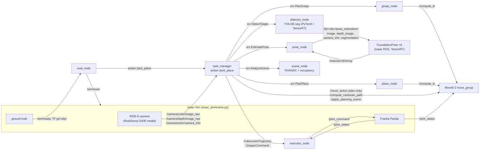

# prompt-pick-place

Visual-prompt pick-and-place in Isaac Sim + ROS 2: YOLOE detection, FoundationPose 6-DoF pose,
grasp & placement planning, TensorRT, and automated evaluation.

Show the robot **one example image** of an object. It finds that object on a cluttered table
(simulated RealSense RGB-D), estimates its 6-DoF pose, picks it with a Franka Panda and puts it
down in a free spot of a cluttered placement area. Everything runs in Isaac Sim + ROS 2 Humble;
every run can be scored automatically against simulator ground truth.

> Demo video / figures: `results/` (filled in from the GPU runs — see [Results](#results)).

## Pipeline

| # | Stage | Method | Code |
|---|---|---|---|
| ① | Target detection from a visual prompt | YOLOE-seg; one example image per object → visual-prompt embedding → class; box + mask | [`detector_node`](ros2/ppp_perception/ppp_perception/detector_node.py), [`yoloe_prompt`](ros2/ppp_perception/ppp_perception/yoloe_prompt.py) |
| ② | 6-DoF pose | Isaac ROS FoundationPose (RGB-D + mask + textured YCB mesh, TensorRT) | [`pose_node`](ros2/ppp_perception/ppp_perception/pose_node.py), [`foundationpose.launch.py`](ros2/ppp_bringup/launch/foundationpose.launch.py) |
| ③ | Spatial perception | depth → world point cloud → table plane RANSAC → place-zone occupancy (free / occupied / unobserved) | [`scene_node`](ros2/ppp_perception/ppp_perception/scene_node.py), [`plane`](ros2/ppp_perception/ppp_perception/core/plane.py), [`free_space`](ros2/ppp_perception/ppp_perception/core/free_space.py) |
| ④ | Grasp pose | parallel-jaw candidates on the mesh's box faces → world via estimated pose → table/tilt filter → IK reachability → best | [`grasp_node`](ros2/ppp_manipulation/ppp_manipulation/grasp_node.py), [`grasp`](ros2/ppp_manipulation/ppp_manipulation/core/grasp.py) |
| ⑤ | Placement | clearance map of the place zone ≥ object footprint radius + margin; nearest to zone centre; yaw candidates; IK check | [`place_node`](ros2/ppp_manipulation/ppp_manipulation/place_node.py), [`place`](ros2/ppp_manipulation/ppp_manipulation/core/place.py) |
| ⑥ | Task execution | MoveIt 2 (OMPL joint-space + Cartesian approach/lift/descend) → trajectory executor → Isaac Sim | [`task_manager`](ros2/ppp_manipulation/ppp_manipulation/task_manager.py), [`executor_node`](ros2/ppp_manipulation/ppp_manipulation/executor_node.py) |
| ⑦ | Evaluation | randomized episodes, scored with simulator ground truth; latency per stage | [`eval_node`](ros2/ppp_eval/ppp_eval/eval_node.py), [`metrics`](ros2/ppp_eval/ppp_eval/core/metrics.py) |

The perception results feed the task directly: the RANSAC table height becomes the MoveIt collision
table and the grasp/placement height reference; the occupancy grid drives placement; the estimated
pose defines grasp and the object's pose after placement.

## Architecture (ROS 2 data path)



### Node interfaces

| Node | Inputs | Outputs |
|---|---|---|
| `isaac_sim/scene.py` | `/joint_command` (JointState), `/sim/reset` (String JSON) | `/camera/color/image_raw` rgb8, `/camera/depth/image_raw` 32FC1 m, `/camera/color/camera_info`, `/joint_states`, `/tf` (`gt/<obj>`), `/tf_static` (camera), `/sim/ready` |
| `detector_node` | srv `/perception/detect` (target, rgb) | bbox, score, mask (mono8); `/perception/detection_overlay` |
| `pose_node` | srv `/perception/estimate_pose` (target, rgb, depth, info, mask) | object pose in world + camera frame; `/perception/target_pose`, `/perception/pose_overlay` |
| FoundationPose (per object) | `/fp/<obj>/pose_estimation/{image, depth_image, camera_info, segmentation}` | `/fp/<obj>/pose_estimation/output` (Detection3DArray) |
| `scene_node` | srv `/perception/analyze_scene` (depth, info) | plane, table height, place-zone OccupancyGrid; `/perception/place_zone_grid`, `/perception/scene_markers` |
| `grasp_node` | srv `/manipulation/plan_grasp` (target, object pose, table height) | hand grasp / pre-grasp pose, IK seed, grasp in object frame; `/manipulation/grasp_markers` |
| `place_node` | srv `/manipulation/plan_place` (target, object pose, grasp, grid) | object place pose, hand place / pre-place pose; `/manipulation/place_markers` |
| `task_manager` | action `/pick_place` (target) + camera topics | result with bbox, pose, grasp, place, per-stage latency; feedback = stage |
| `executor_node` | `FollowJointTrajectory`, `GripperCommand` actions, `/joint_states` | `/joint_command` |
| `eval_node` | `/sim/ready`, TF `gt/*`, `/pick_place` results | `trials.jsonl`, `summary.json`, `summary.md` |

Interface definitions: [`ppp_interfaces`](ros2/ppp_interfaces). Cell layout, camera, robot, objects and all
thresholds: [`scene.yaml`](ros2/ppp_bringup/config/scene.yaml) (single source for sim, nodes and evaluation).

## Perception spec

Targets for a production-style version of this cell, and how each is measured. Latencies are budgets
per request on the desktop GPU (L40S; no Jetson available), measured by `eval_node` as service
round-trip times (`<stage>`) and in-node compute (`<stage>_compute`).

### Latency budget

| Stage | Budget (p95) | Notes |
|---|---|---|
| Frame capture → request | 100 ms | 10 Hz camera, next fresh frame |
| ① Detection (YOLOE, TensorRT FP16) | 30 ms | incl. pre/post-processing, 640×480 |
| ② 6-DoF pose (FoundationPose, pose estimation mode) | 500 ms | global hypotheses + refine + score; tracking mode would be ~ms |
| ③ Plane + occupancy | 50 ms | stride-2 point cloud, 300 RANSAC iterations |
| ④ Grasp planning | 300 ms | dominated by IK calls (≤ 2 per candidate) |
| ⑤ Placement planning | 300 ms | IK on first free spots |
| **Perception total (①–③)** | **700 ms** | |
| Pick-and-place cycle | 30 s | arm speed limited to 0.8 rad/s in simulation |

### Accuracy targets

| Metric | Target | Definition |
|---|---|---|
| Detection success | ≥ 95 % | IoU(predicted box, projected GT mesh box) ≥ 0.5 for the prompted object |
| Pose success | ≥ 90 % | translation ≤ 10 mm and rotation ≤ 10° (symmetry-aware); ADD / ADD-S reported |
| Grasp success | ≥ 90 % | object ≥ ½ lift height above its start when the arm reports `lifted` |
| Placement success | ≥ 90 % | final xy within 30 mm of the plan, tilt change ≤ 15°, resting on the table |
| Scene disturbance | ≤ 5 % | any other object/clutter moved > 20 mm |

### Failure modes

| Failure | Stage | Detected by | Handling |
|---|---|---|---|
| Target not found / wrong instance | ① | no box of the prompted class above threshold; IoU in eval | fail fast (`failed_stage = detect`) |
| Pose flip on symmetric objects | ② | symmetry-aware error in eval | box-face grasps are symmetric by construction; `cylinder_z` / `box180` symmetry classes |
| Depth holes / occlusion shadows | ②③ | unobserved cells in the grid | unobserved = not free (never place into unseen space) |
| No table plane | ③ | RANSAC inliers below minimum / tilt > 20° | fail fast |
| No reachable grasp | ④ | all candidates fail geometry or IK | fail fast, report candidate counts |
| No free spot | ⑤ | clearance < footprint radius + margin everywhere, or IK fails | fail fast, report spots tried |
| Grasp miss / slip | ⑥ | gripper closes fully (width < 2 mm) after close or after lift | abort, open gripper, return home |
| Planning / execution error | ⑥ | MoveIt error code, Cartesian fraction < 95 %, tracking error | abort, recover (lift, home) |

## Evaluation

`eval_node` runs N episodes (default 50). Each episode resets the simulator with a seed (3–4 random YCB
objects at random positions/yaw in the pick zone, 1–3 random boxes in the place zone), picks a random
present object as the target, runs `/pick_place` and scores the result against the simulator's ground
truth (`gt/<obj>` TF frames): detection IoU, pose errors (translation, symmetry-aware rotation, ADD,
ADD-S), grasp (object lifted), placement (final pose vs plan), side effects, and latency per stage.

Objects (YCB, google_16k scans): 004 sugar box, 005 tomato soup can, 006 mustard bottle,
010 potted meat can, 061 foam brick, 077 Rubik's cube — all graspable top-down with the 8 cm Panda gripper.

## Results

_Pending the first GPU runs (L40S). Commands: [docs/SETUP.md §5–6](docs/SETUP.md)._

| Metric | Value |
|---|---|
| Detection / pose / grasp / place / task success | – |
| Translation / rotation error (median) | – |
| Latency per stage (p50 / p95) | – |

| YOLOE backend (L40S, desktop GPU) | inference p50 | end-to-end p50 |
|---|---|---|
| PyTorch FP32 | – | – |
| PyTorch FP16 | – | – |
| TensorRT FP16 | – | – |

## Repository layout

```
isaac_sim/          scene.py (sim + ROS 2 I/O + randomized episodes), capture_prompts.py, ycb_usd.py
ros2/
  ppp_interfaces/   services + PickPlace action
  ppp_common/       transforms, OBJ reader, scene config, ROS helpers
  ppp_perception/   detector_node (YOLOE), pose_node (FoundationPose bridge), scene_node (plane/free space)
  ppp_manipulation/ grasp_node, place_node, task_manager, executor_node, MoveIt client
  ppp_eval/         eval_node, metrics, summarize
  ppp_bringup/      launch files, scene.yaml, MoveIt controllers, RViz
scripts/            prepare_ycb.py, yoloe_trt.py (export + benchmark), build_fp_engines.sh, snapshot.py
docker/             Isaac ROS image layer, Fast DDS UDP profile
tests/              unit tests of the geometry / planning / metrics cores (no GPU needed)
```

Setup, run and evaluation commands: [docs/SETUP.md](docs/SETUP.md).

## Scope

Simulation only. Deliberately not included: learned grasp networks, SAM 2, nvblox, domain
randomization of lighting/texture, sim-to-real, stacking, Jetson deployment.
