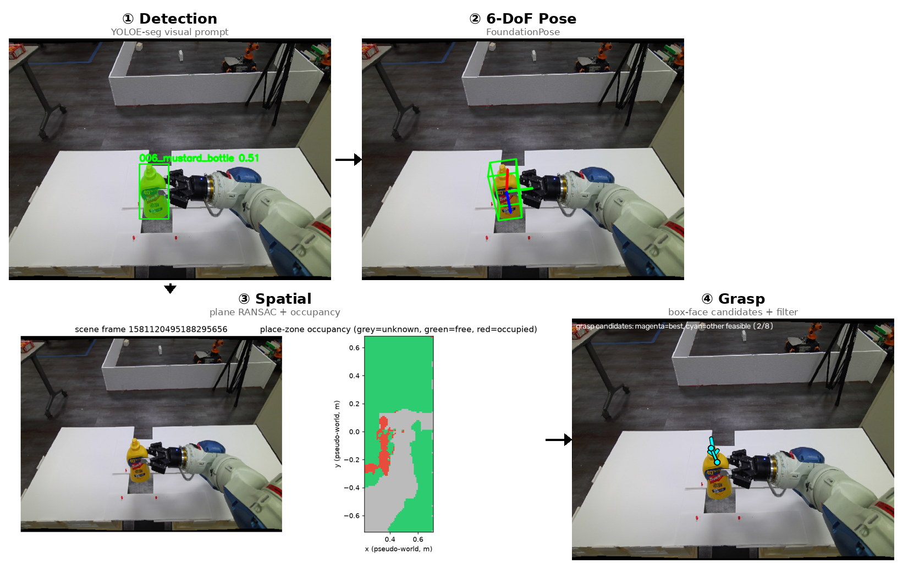

# prompt-pick-place — vision pipeline

Show it **one example image** (or type a phrase) → it finds the object, estimates its 6-DoF pose,
maps the table, and proposes grasps. Real RGB-D images, no robot, no simulator, no ROS.



## The pipeline

| # | Stage | Script | Runs in | Model / method |
|---|---|---|---|---|
| 1 | Detect + mask | [`pipeline/01_detect.py`](pipeline/01_detect.py) | host | YOLOE-seg, visual prompt (example image + box) |
| 2 | 6-DoF pose | [`pipeline/02_pose.py`](pipeline/02_pose.py) | container | FoundationPose (uses stage 1's mask) |
| 3 | Table + free space | [`pipeline/03_spatial.py`](pipeline/03_spatial.py) | host | RANSAC plane + occupancy grid |
| 4 | Grasp candidates | [`pipeline/04_grasp.py`](pipeline/04_grasp.py) | host | Box-face parallel-jaw grasps + geometric filter |

- Stages pass files through `output/` (each script reads the previous one's output) — run them in order.
- **container** = the `foundationpose` Docker container (FoundationPose's CUDA extensions). **host** = `.venv` (torch + ultralytics for stage 1, numpy for 3-4).

## Run

```bash
docker start foundationpose
pipeline/run_all.sh                 # stages 1-4 on the mustard0 sequence -> output/
```

| Other entry points | What it does | Runs in |
|---|---|---|
| [`notebooks/yoloe_playground.ipynb`](notebooks/yoloe_playground.ipynb) | **Stage 1 live playground**: text / visual / prompt-free, sliders, re-renders instantly. Open it in Cursor (or `.venv/bin/jupyter lab --no-browser`). Guide: [docs/STAGE1_DETECT.md](docs/STAGE1_DETECT.md) | host |
| [`pipeline/interactive_detect.py`](pipeline/interactive_detect.py) | Same playground as a CLI (`--text` / `--ref` / `--prompt` / `--prompt-free`) | host |
| [`pipeline/interactive_pose.py`](pipeline/interactive_pose.py) | **Stage 2 playground**: mustard bottle on the stage 1 image → YOLOE mask → pose, top hypotheses, timing (`--iterations`, `--n-views`). Guide: [docs/STAGE2_POSE.md](docs/STAGE2_POSE.md) | host (re-runs itself in the container) |
| [`pipeline/render_mesh.py`](pipeline/render_mesh.py) | Mesh as FoundationPose sees it: texture / shape / vertices / triangles side by side, or at a pose over the scene (`--pose TAG`) | host (re-runs itself in the container) |
| [`pipeline/interactive_spatial.py`](pipeline/interactive_spatial.py) | **Stage 3 playground**: depth → table plane (RANSAC) → occupancy grid, 4 panels + the stage 2 bottle on the table. Guide: [docs/STAGE3_SPATIAL.md](docs/STAGE3_SPATIAL.md) | host |
| [`pipeline/interactive_grasp.py`](pipeline/interactive_grasp.py) | **Stage 4 playground**: box-face grasp candidates on the stage 2 pose → tilt / table / collision filter from stage 3's RANSAC geometry. Guide: [docs/STAGE4_GRASP.md](docs/STAGE4_GRASP.md) | host |
| [`pipeline/interactive_place.py`](pipeline/interactive_place.py) | **Stage 5 playground**: wrist-camera view of the sim shelf → horizontal supports → free space → where the object fits. Guide: [docs/STAGE5_PLACE.md](docs/STAGE5_PLACE.md) | host |
| [`pipeline/talk_and_pick.py`](pipeline/talk_and_pick.py) | Text command → stages 1-4 → 4-panel composite | host (calls the container for stages 1-2) |
| [`sim/scene.py`](sim/scene.py) | **Isaac Sim cell** (table with 6 YCB items, Franka, shelf, RGB-D camera) → frames + ground-truth masks/poses for the demo picks (mustard, tomato can) in `data/sim/` for stage 2 (`interactive_pose.py --data data/sim/005_tomato_soup_can`). Guide: [docs/SIM.md](docs/SIM.md) | `.venv-sim` |
| `pytest tests` | Unit tests for `vision/` (no GPU) | host |

```bash
PY=.venv/bin/python
$PY pipeline/interactive_detect.py --text "mustard bottle" --text banana          # text prompts
$PY pipeline/interactive_detect.py --ref 005_tomato_soup_can --ref 006_mustard_bottle   # visual prompts
$PY pipeline/interactive_detect.py --prompt-free --conf 0.25                             # no prompt: built-in vocabulary
$PY pipeline/interactive_detect.py --prompt my_obj ref.png 120,80,340,410 --scene scene.png --conf 0.2 --imgsz 1280

.venv/bin/python pipeline/talk_and_pick.py --command "pick up mustard sauce"
.venv/bin/python pipeline/talk_and_pick.py --repl
```

## Where things are

| Path | What |
|---|---|
| `vision/` | **The algorithms** (import these when experimenting) |
| `vision/detect.py` | Stage 1: YOLOE text / visual / prompt-free model builders, `detect()` |
| `vision/pose.py` | Stage 2: FoundationPose `build_estimator()`, `register()`, `draw_pose()` (container only) |
| `vision/spatial.py` | Stage 3: depth → points, RANSAC plane, occupancy grid, `analyze_scene()` |
| `vision/grasp.py` | Stage 4: candidate generation + filter |
| `vision/viz.py`, `transforms.py` | Overlays / plots, 4×4 pose math |
| `config.yaml` | **Every tunable parameter** (YOLOE conf/iou/imgsz/weights, RANSAC, grid, gripper, grasp filter) |
| `pipeline/` | Runnable scripts (above) |
| `sim/` | Isaac Sim 6.1 cell (`scene.py`) + OBJ → USD converter (`ycb_usd.py`). Own venv: `.venv-sim` |
| `notebooks/` | Live playgrounds |
| `.vscode/settings.json` | Makes ipywidgets load in Cursor over Remote-SSH (jsDelivr CDN first) |
| `scripts/` | `prepare_ycb.py`, `yoloe_trt.py`, `build_fp_engines.sh` (see [TensorRT](#tensorrt-not-yet-run)) |
| `tests/` | Unit tests |
| `docs/DECISIONS.md` | **Decision & issue log**: why things are the way they are, known issues, roadmap |
| `docs/pipeline_demo/` | Committed result screenshots (shown in this README) |
| `models/` | Model weights: `yoloe-11{s,m,l}-seg.pt`, prompt-free `yoloe-11{s,m,l}-seg-pf.pt`, `mobileclip_blt.ts` (gitignored) |
| `output/` | Results of your runs (gitignored); YOLOE playground -> `output/yoloe/`, pose playground -> `output/pose/`, mesh renders -> `output/mesh/`, spatial playground -> `output/spatial/`, grasp playground -> `output/grasp/`, place playground -> `output/place/` |

## Data

| Data | Location | Used by | How to get it |
|---|---|---|---|
| mustard0 RGB-D sequence + mesh | `third_party/FoundationPose/demo_data/mustard0/` | stages 1-4 (`run_all.sh`) | FoundationPose setup (below) |
| Multi-object scene (BOP YCB-Video, 5 objects) + reference crops | `data/multi_object_scene/` | `interactive_detect`, `talk_and_pick` | tracked in git |
| YCB meshes (6 objects) | `assets/ycb/<obj>/textured.obj` | `talk_and_pick` (pose + grasp) | `python scripts/prepare_ycb.py` |
| YOLOE weights + text encoder | `models/` | stage 1 | auto-downloaded on first run |
| FoundationPose weights | `third_party/FoundationPose/weights/` | stage 2 | FoundationPose setup |

## Results

| Stage | Input | Result |
|---|---|---|
| 1 | mustard0 frame 736, prompt from frame 0 | `006_mustard_bottle` score **0.51** ([image](docs/pipeline_demo/01_detection.png)) |
| 2 | stage 1 mask | 6-DoF pose overlay ([image](docs/pipeline_demo/02_pose_overlay.png)) |
| 3 | depth | plane 88k / 132k inliers; grid 140×50 cells, 4634 free / 321 occupied / 2045 unknown ([image](docs/pipeline_demo/03_occupancy.png)) |
| 4 | pose + mesh | **2 / 8** candidates feasible; best is 8.5° from vertical ([image](docs/pipeline_demo/04_grasp_candidates.png)) |
| 1 (multi-object) | tomato soup can / mustard bottle prompts | 0.71 / 0.55, no false positives on cracker box, banana, drill ([image](docs/pipeline_demo/multi_object/overview.png)) |

`talk_and_pick.py` on the multi-object scene:

| Command | Result |
|---|---|
| `pick up mustard sauce` | detected 0.68 → pose → **2/8** grasps feasible ([image](docs/pipeline_demo/multi_object/full_pipeline_mustard_sauce.png)) |
| `grab the tomato soup can` | detected 0.40 → pose → **4/16** feasible ([image](docs/pipeline_demo/multi_object/full_pipeline_tomato_soup_can.png)) |
| `pick up the cheez-it box` | detected 0.75 → stops (no mesh for it) ([image](docs/pipeline_demo/multi_object/full_pipeline_cheez_it_box.png)) |

## Things to know

- **No real world frame.** Stage 3 builds one from the table itself: table normal = +Z, table height = 0.
- **Stage 4 mesh = stage 2 mesh.** On mustard0 it uses FoundationPose's own mesh, not `assets/ycb`, so pose and geometry agree.
- **Stage 4 has no IK/reachability check** — no robot here; it only filters by approach tilt and table clearance.
- **Bottle on its side → 0/8 grasps.** Correct: no top-down grasp exists. `run_all.sh` uses the final (upright) frame.
- **Prompted YOLOE finds nothing without prompts.** `yoloe-*-seg.pt` with no classes set returns 0 detections, no error. "Detect everything" needs the separate `-seg-pf.pt` weights (`--prompt-free`).
- **Text prompts are wording-sensitive.** `"mustard bottle"` scores 0.68, `"mustard sauce"` 0.008. `talk_and_pick` swaps in a canonical phrase for the 6 known objects.
- **`talk_and_pick` is not an LLM.** Prefix stripping + keyword match to a mesh; the detection itself is YOLOE.
- **Container teardown crash.** The container's Python occasionally prints `free(): double free` on exit (after the results are written). Re-run.

## Setup (one time)

Tested: Ubuntu 24.04, NVIDIA L40S, driver ≥ 580, Docker.

**Host env** (stages 1, 3-4, notebook, tests; pulls CUDA torch, ~3 GB):
```bash
python3 -m venv .venv && .venv/bin/pip install -r requirements.txt
```

**FoundationPose container** (stage 2; also stages 1-2 for `talk_and_pick.py`):
- `git clone https://github.com/NVlabs/FoundationPose third_party/FoundationPose`
- Follow its README for Docker. On Ada-class GPUs (L40S) use the image `shingarey/foundationpose_custom_cuda121:latest`.
- Inside the container run its `build_all.sh`, then download its weights and `demo_data` (has `mustard0`).
- Name the container `foundationpose`. It must mount **`/home:/home`** so the repo has the same path inside and outside.
- `pip install ultralytics` inside the `my` env (needs `>=8.3.150`).

## TensorRT (not yet run)

Written but never executed — this is the next piece of work.

| Script | Purpose |
|---|---|
| [`scripts/yoloe_trt.py`](scripts/yoloe_trt.py) | `export` the visual-prompt YOLOE to a TensorRT engine; `bench` PyTorch FP32 / FP16 / TensorRT latency |
| [`scripts/build_fp_engines.sh`](scripts/build_fp_engines.sh) | Build TensorRT engines for FoundationPose's refiner + scorer from NVIDIA's ONNX models |

| Backend (L40S) | inference p50 | end-to-end p50 |
|---|---|---|
| PyTorch FP32 | – | – |
| PyTorch FP16 | – | – |
| TensorRT FP16 | – | – |

## History

Earlier versions had a ROS 2 + Isaac Sim + MoveIt pick-and-place stack. It was removed to focus on the
vision pipeline; it is still in git at commit `255a4aa` (`git checkout 255a4aa -- ros2 isaac_sim docker docs/SETUP.md`).
