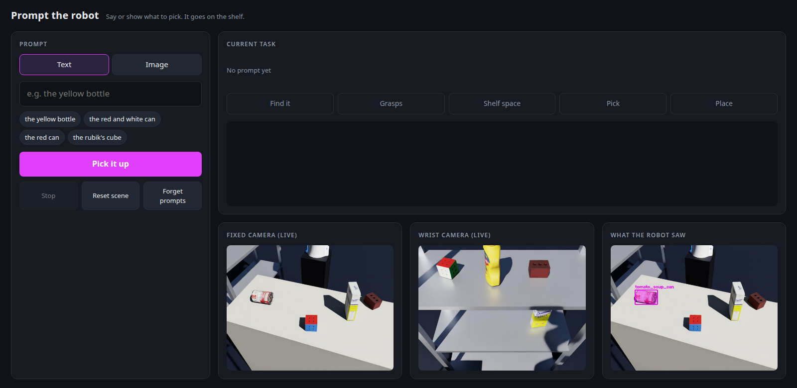

# prompt-pick-place

**Vision-driven pick-and-place from a prompt.** Show the robot one example image (or type a phrase), and it
finds that object on the table, estimates its 6-DoF pose, plans a grasp, and finds free space on a shelf to
put it — with no object-specific training and no prior model of the shelf.


*Simulated cell (Isaac Sim 6.1): Franka Panda with lengthened fingers, a table of YCB objects, a metal pantry as the
place target, a fixed RealSense D455 over the table, and a wrist-mounted D455 that looks into the shelf.*

## Pipeline

| # | Stage | Question it answers | Method | Status |
|---|---|---|---|---|
| 1 | **Detect** | Where is the object I was shown? | YOLOE-seg, visual or text prompt → box + mask | ✅ Built |
| 2 | **Pose** | What is its exact 6-DoF pose? | FoundationPose (model-based, mask-initialised) | ✅ Built |
| 3 | **Table** | Where is the table, and what is free? | RANSAC plane + occupancy grid | ✅ Built |
| 4 | **Grasp** | How should the gripper take it? | Parallel-jaw candidates + tilt / table / collision filter | ✅ Built |
| 5 | **Place** | Where on the shelf does it fit? | Sequential RANSAC for horizontal supports + free-space search | ✅ Built |
| — | **Execute** | Move the robot | ROS 2 Jazzy · MoveIt 2 (pick_ik, Pilz, OMPL) · BehaviorTree.CPP · ros2_control in Isaac Sim | ✅ Built |


```
fixed camera ─► 1 Detect ─► 2 Pose ──┐
fixed camera ─► 3 Table ─────────────┴─► 4 Grasp ──┐
wrist camera ─► 5 Place ───────────────────────────┴─► grasp + placement chosen together ─► pick ─► place
                (the arm looks at the shelf before it picks)
```

In ROS 2 each stage is a node (stage 2 is Isaac ROS FoundationPose in Docker, stage 3 and the RANSAC of stage 5 are
C++); a BehaviorTree.CPP task manager sequences them and moves the Panda through MoveIt 2 and ros2_control running
inside Isaac Sim. It chooses a grasp and a placement together, and moves between IK solutions chained from one natural
arm configuration (straight joint-space lines, else via home, STOMP or RRTConnect), with the held object part of the robot for collision
checking. Guide: [docs/ROS.md](docs/ROS.md). A web page prompts it with a phrase or an example image and shows
what the robot saw and what it is doing: [Prompt UI](docs/ROS.md#prompt-ui).

## Results

| Stage | Measured |
|---|---|
| 1 Detect | Mustard bottle found from one example image, score 0.55, no false positives among 5 objects · ~17 ms / frame (L40S) |
| 2 Pose | Sim, vs. ground truth: **0.5–1.5°, < 1 mm** (upright bottle and a can lying on its side) · ~0.9 s / registration |
| 3 Table | Table plane from 52 % of the points; recovered bottle height 92 mm vs. 96 mm true (pose and plane agree) |
| 4 Grasp | 2 of 8 candidates feasible; best approaches 2° from vertical |
| 5 Place | The three visible pantry boards found at their true heights (−0.35 / 0.05 / 0.45 m) · 6 placements ranked by clearance · 0.2 s |
| Whole task | Randomised episodes, perception to placement: **mustard 10/10, tomato can 8/10** (stood upright, 10 episodes, two-board shelf) · 3/3 each in the pantry cell ([D-041](docs/DECISIONS.md#d-041)) · 77 % of moves a single straight joint-space line |

Stage-by-stage details, numbers and failure cases are in each guide below.

## Quick start

Tested on Ubuntu 24.04, NVIDIA L40S, driver 580.

```bash
python3 -m venv .venv && .venv/bin/pip install -r requirements.txt      # vision (stages 1, 3–5)
docker start foundationpose                                             # stage 2 (FoundationPose + CUDA extensions)
```

To run the whole robot, skip to [Run the robot](#run-the-robot).

### Vision playgrounds (each stage on its own)

**Not part of the robot pipeline.** Each command runs one vision algorithm by itself on a stored RGB-D scene: no
sim, no ROS, no robot. Use them to try a stage, tune its parameters in `config.yaml`, or debug it. Each prints a
report and writes an annotated image to `output/`.

```bash
source .venv/bin/activate
python pipeline/interactive_detect.py --ref 006_mustard_bottle     # 1 detect
python pipeline/interactive_pose.py                                 # 2 pose (runs itself in the container)
python pipeline/interactive_spatial.py                              # 3 table + free space
python pipeline/interactive_grasp.py                                # 4 grasp
python pipeline/interactive_place.py                                # 5 place (needs the sim capture below)
.venv-sim/bin/python sim/scene.py                                   # Isaac Sim: RGB-D + ground truth -> data/sim/
```

## Run the robot

Three terminals, **all on the workstation**, each starting from the repo root (`cd ~/workspace/prompt-pick-place`).
One-time setup: [docs/ROS.md](docs/ROS.md#setup-once).

| Terminal | Starts | Ready when it prints |
|---|---|---|
| 1 | Isaac Sim cell (robot, table, cameras) | `[ros_cell] running` |
| 2 | Robot drivers, MoveIt, perception | `[detect_node]: ready`, then ~1 min for FoundationPose's TensorRT engines |
| 3 | **What the robot does: option A *or* option B** (never both: they drive the same arm) | — |

### Terminal 1 · sim

```bash
cd ~/workspace/prompt-pick-place
.venv-sim/bin/python sim/ros_cell.py
```

To watch the sim's viewport from a laptop, add `--livestream` ([below](#sim-viewport-livestream-webrtc)).

### Terminal 2 · robot, MoveIt, perception

```bash
cd ~/workspace/prompt-pick-place
source ros2/install/setup.bash && ros2 launch ppp_bringup all.launch.py eval:=true
```

The robot stays still until terminal 3 gives it a task.

### Terminal 3 · pick **one** option

| | Option A · web page (demo) | Option B · scripted |
|---|---|---|
| You | Type a phrase or drop an example image, press **Pick it up** | Nothing: it starts at once |
| Robot | Picks the prompted object, one per prompt; waits for the next | Picks each target, prints a summary, exits |
| Stop | Ctrl+C (or **Stop** on the page) | Ctrl+C |

**Option A · web page**

```bash
cd ~/workspace/prompt-pick-place
source ros2/install/setup.bash && .venv/bin/python ui/prompt_ui.py
```

Then open **http://localhost:8088** (from a laptop: [below](#prompt-ui-in-the-laptops-browser)).



*The **Prompt UI**: type a phrase or drop an example image on the left,
follow the task's steps at the top right, and watch the fixed and wrist cameras live, with what the robot detected, at
the bottom.*

| Control | What it does |
|---|---|
| **Text** tab | A phrase, e.g. "the yellow bottle" or "the red can" |
| **Image** tab | Drop an example image or pick a sample (`assets/prompts/`), then drag a box around the object (default: the whole image) |
| **Pick it up** | Finds the prompted object, then picks it and places it on the shelf |
| **Stop** · **Reset scene** · **Forget prompts** | Stop the task · re-drop the table objects · go back to the stored example images |

Options: `--port` (default 8088), `--camera` / `--wrist-camera` (image topics). Details:
[Prompt UI](docs/ROS.md#prompt-ui).

**Option B · scripted**

```bash
cd ~/workspace/prompt-pick-place
source ros2/install/setup.bash && ros2 launch ppp_bringup task.launch.py   # every target, one after the other
```

One target only: `ros2 launch ppp_bringup task.launch.py targets:='[tomato_soup_can]'`.

**Pitfalls.** Run one sim at a time. After restarting the sim (terminal 1), restart terminal 2 too: running nodes
keep the old sim time.

## Watching from another machine

Everything runs on the workstation; a laptop only views it. The workstation's IP (run on the workstation):

```bash
hostname -I | awk '{print $1}'        # e.g. 192.168.33.118 -> <workstation-ip> below
```

**Ports (on the workstation):**

- **Prompt UI:** TCP 8088
- **Foxglove:** TCP 8765
- **Sim livestream:** TCP 49100 + UDP 47998. UDP can't go through an SSH tunnel: the laptop must be on the same LAN or a VPN

### Prompt UI in the laptop's browser

| How you reach the workstation | Open in the laptop's browser |
|---|---|
| Same network | `http://<workstation-ip>:8088` |
| Cursor / VS Code Remote-SSH | `http://localhost:8088` (the editor forwards the port by itself: Ports tab) |
| Plain SSH | First, on the laptop: `ssh -L 8088:localhost:8088 <user>@<workstation-ip>`; then `http://localhost:8088` |

### Sim viewport: livestream (WebRTC)

**1 · Laptop, once:** download the **Isaac Sim WebRTC Streaming Client** for your OS from the
[Isaac Sim download page](https://docs.isaacsim.omniverse.nvidia.com/latest/installation/download.html) and install it.

**2 · Start the sim with streaming.** Either type it in a workstation terminal (e.g. Cursor's):

```bash
cd ~/workspace/prompt-pick-place
.venv-sim/bin/python sim/ros_cell.py --livestream
```

or start it from the laptop in one line (PowerShell or any terminal; the sim stops when this window closes):

```bash
ssh -t <user>@<workstation-ip> "cd ~/workspace/prompt-pick-place && .venv-sim/bin/python sim/ros_cell.py --livestream"
```

Wait until it prints both lines:

```text
[ros_cell] streaming on TCP 49100 / UDP 47998 - connect the Isaac Sim WebRTC Streaming Client to this machine's IP
[ros_cell] running: cameras at 10.0 Hz sim time, rtf cap 1.0. Ctrl+C to quit.
```

This is terminal 1: start terminals 2 and 3 as usual.

**3 · Laptop:** open the Streaming Client and connect:

| Field | Value |
|---|---|
| Server | `<workstation-ip>`, e.g. `192.168.33.118`: the bare IP, no `http://`, no port |
| Ports | None to enter: the client uses TCP 49100 and UDP 47998 by itself |
| Then | **Connect**; the viewport appears in a few seconds |

**If it doesn't connect**

| Symptom | Fix |
|---|---|
| Nothing appears | The laptop must reach the workstation directly (same LAN or VPN): video is UDP, which an SSH tunnel can't carry |
| Still nothing, firewall on | On the workstation: `sudo ufw allow 49100/tcp && sudo ufw allow 47998/udp` |
| Picture freezes | Close the client and connect again; the sim keeps running. One client at a time |
| `NVST Error: NVST_R_BUSY` in the sim terminal | Connection noise from the client; harmless |

### ROS data: Foxglove

**1 · Workstation**, terminal 2 with the bridge:

```bash
cd ~/workspace/prompt-pick-place
source ros2/install/setup.bash && ros2 launch ppp_bringup all.launch.py eval:=true foxglove:=true
```

**2 · Laptop:** in [Foxglove](https://foxglove.dev/download), **Open connection → Foxglove WebSocket**, URL
`ws://<workstation-ip>:8765`. Through SSH instead: `ssh -L 8765:localhost:8765 <user>@<workstation-ip>` and
`ws://localhost:8765`.

## Documentation

| Guide | Covers |
|---|---|
| [Stage 1 — Detect](docs/STAGE1_DETECT.md) | Text / visual / prompt-free YOLOE, knobs, how the YOLOE head works |
| [Stage 2 — Pose](docs/STAGE2_POSE.md) | FoundationPose hypotheses, refiner, scorer; mesh renderer |
| [Stage 3 — Table](docs/STAGE3_SPATIAL.md) | RANSAC, table frame, occupancy grid |
| [Stage 4 — Grasp](docs/STAGE4_GRASP.md) | Candidates, filter, object and gripper poses in every frame |
| [Stage 5 — Place](docs/STAGE5_PLACE.md) | Shelf supports, headroom, placement candidates |
| [Simulation](docs/SIM.md) | Cell layout, gripper, cameras, datasets, livestream |
| [ROS 2 pipeline](docs/ROS.md) | Nodes, behavior tree, motion planning, FoundationPose container, episodes |
| [Decisions & issues](docs/DECISIONS.md) | Why things are the way they are, known issues, roadmap |

## Repository

| Path | Contents |
|---|---|
| `vision/` | The algorithms: `detect`, `pose`, `spatial`, `grasp`, `place`, `transforms` |
| `pipeline/` | Offline stage playgrounds (`interactive_*.py`) and the scripted mustard0 run; not used by the robot |
| `sim/` | Isaac Sim cell (`cell.py`): dataset capture (`scene.py`), live over ROS 2 (`ros_cell.py`), episodes |
| `ros2/src/` | ROS 2 packages: `ppp_interfaces`, `ppp_geometry` (C++ RANSAC + pybind11), `ppp_spatial`, `ppp_perception`, `ppp_task` (behavior tree), `ppp_bringup` |
| `docker/` | Isaac ROS 4.5 FoundationPose image + start script |
| `ui/` | Prompt UI: web page to prompt the robot with a phrase or an example image (`prompt_ui.py`) |
| `config.yaml` | Every tunable parameter, per stage and for the sim |
| `data/` | Multi-object RGB-D scene (BOP YCB-Video) + reference crops; sim captures (generated) |
| `docs/` | Stage guides, sim guide, decision log, figures |
| `tests/` | Unit tests for `vision/` + C++/numpy RANSAC equivalence (`pytest`, no GPU) |

## Roadmap

| Phase | Goal | Status |
|---|---|---|
| 0 · Environment | ROS 2 Jazzy workspace, MoveIt 2, Isaac ROS 4.5 FoundationPose | ✅ |
| 1 · Sim ↔ ROS | Cameras, clock and ros2_control from Isaac Sim over ROS 2 | ✅ |
| 2 · Motion | MoveIt reaches both pick targets and the shelf | ✅ |
| 3 · Perception nodes | One node per stage; shared C++ RANSAC for stages 3 and 5 | ✅ |
| 4 · Task | Behavior tree: look at the shelf → pick from the table → place | ✅ |
| 4b · Clean motions | Reachable layout, longer fingers, chained IK + straight joint-space moves | ✅ 18/20 placed (was 9/16) |
| 5 · Robustness | Hand-eye calibration, sensor noise, vision checks (D-039), success rate over randomised episodes | 🗺️ Next |

Details and rationale: [docs/DECISIONS.md](docs/DECISIONS.md).
