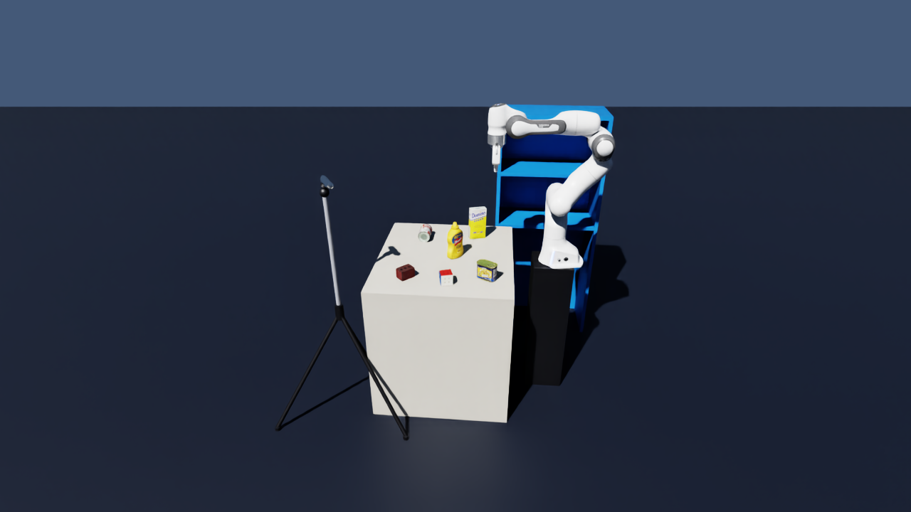
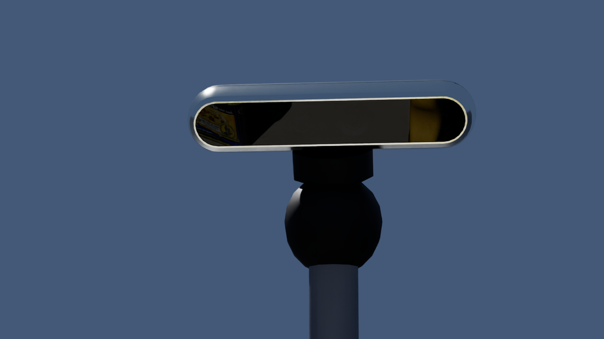
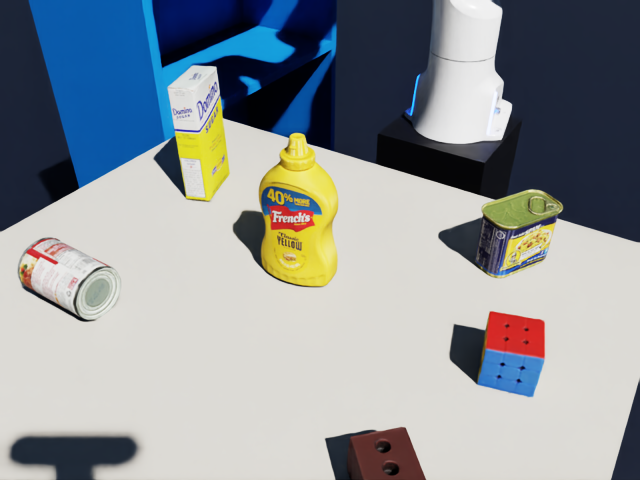

# Isaac Sim cell — table, YCB objects, Franka, shelf, RGB-D camera

A simple simulated cell that runs **alongside** the vision work. For now it only **writes datasets**:
RGB-D frames in the same layout as FoundationPose's `mustard0`, **plus ground-truth masks and poses for the pick targets**,
so stage 2 can be scored (rotation / translation error). No ROS yet; the ROS 2 bridge comes later.


| Piece | What |
|---|---|
| Table | 0.7 × 0.8 m box in front of the robot (+x), top at world z = 0 |
| Pick targets | `006_mustard_bottle` (upright) and `005_tomato_soup_can` (**lying on its side**): the two demo picks. Random yaw each frame; each gets its own mask + ground-truth pose. **Same OBJs FoundationPose uses** (`sim/ycb_usd.py` → USD), so ground truth and estimate share one object frame |
| Other items | Sugar box, potted meat can, foam brick, Rubik's cube at fixed spots, placed so nothing blocks the camera's view of the targets |
| Lying can | Rocks ~7 mm onto a flat of its collision hull in the first 2 s, then stays put (checked over 20 s, at every yaw) |
| Shelf | Open shelf 90° to the robot's right (−y), opening facing the robot. Levels at z = 0 / 0.32 / 0.64 m; every level is 0.6–0.8 m from the shoulder (Franka reach ≈ 0.85 m), so it is the place target for pick-and-place |
| Robot | Franka Panda (NVIDIA asset), base at the world origin on a pedestal, held in its home pose. Idle for now |
| Shelf items | Sugar box + potted meat can on the bottom level, soup can on the middle one (`shelf_objects`): stage 5 must find the space around them |
| Wrist camera | Same intrinsics, on the Franka hand (5 cm to the side, looking along the fingers). Each frame: table shot at home, then the arm moves to `wrist_camera.look_joints` (IK: camera at (0, −0.05, 0.95) looking into the shelf) and the wrist camera takes the shelf shot → `data/sim/shelf/` |
| Camera | Pinhole 640×480, fx = fy = 615, front-left of the table (robot's view), 0.5 m above it and ~0.73 m from the bottle, looking 36° down at the table centre. Rendered as a **RealSense D455** (NVIDIA asset) on a ball head + floor tripod; the colour lens sits exactly on the optical centre. The rig is visual only and never appears in the camera's own images |
| Look | Dark slate floor, blue-grey backdrop, light-grey table, blue shelf. Colours are sRGB in `sim.colors` |

| Camera rig | D455 model |
|---|---|
|  |  |



## Setup (once)

Workstation, Cursor terminal. Isaac Sim gets its **own** venv (`.venv-sim`, Python 3.12), separate from
the vision `.venv`. About 30–40 GB of downloads.

```bash
cd ~/workspace/prompt-pick-place
uv venv .venv-sim --python 3.12
uv pip install --python .venv-sim/bin/python "isaacsim[all,extscache]==6.1.0.0" \
    --extra-index-url https://pypi.nvidia.com --index-strategy unsafe-best-match
```

The first run asks you to accept the NVIDIA Omniverse EULA (type `Yes`, or set `OMNI_KIT_ACCEPT_EULA=YES`)
and then compiles shaders: about **3 min** once. After that a whole `scene.py` run takes about **12 s**.
The Franka asset is downloaded from NVIDIA's asset server (needs internet).

## Commands

```bash
.venv-sim/bin/python sim/scene.py                 # 1 frame  -> data/sim/
.venv-sim/bin/python sim/scene.py --frames 10     # 10 frames, new random target yaws each
.venv-sim/bin/python sim/scene.py --livestream    # view only: stream the scene to the laptop (below)
.venv-sim/bin/python sim/scene.py --help
```

Then run stage 2 on a sim frame (host `.venv`, same as before), pointing `--data` at a target's folder.
The mask defaults to the sim's ground-truth mask, and the report ends with the error against the ground-truth pose:

```bash
.venv/bin/python pipeline/interactive_pose.py --data data/sim/006_mustard_bottle --frame 0 --tag mustard0
.venv/bin/python pipeline/interactive_pose.py --data data/sim/005_tomato_soup_can --frame 0 --tag tomato0
#   ...
#   vs ground truth: rotation 1.14 deg | translation 0.2 mm
```

Measured on the 3 default frames (seed 0, L40S, camera ~0.75 m):

| Target | Rotation error | Translation error |
|---|---|---|
| Mustard bottle (upright) | 0.49 / 1.48 / 0.92° | 0.7 / 0.2 / 0.6 mm |
| Tomato can (lying) | 1.14 / 0.94 / 0.58° | 0.2 / 0.4 / 0.7 mm |

~880 ms per registration; run-to-run spread on the same frame is ~0.5°. Sim depth is perfect and the mask is exact, so this is
FoundationPose's best case. Real frames (noisy depth, YOLOE mask) will be worse. That gap is what to measure next.

## Output

`data/sim/` (gitignored; wiped and rewritten each run). The images are shared; each target gets a complete
FoundationPose-layout folder (same as `mustard0`) whose `rgb`, `depth` and `cam_K.txt` link to `scene/`:

```
data/sim/scene/                 rgb/ depth/ cam_K.txt T_base_cam.txt
data/sim/006_mustard_bottle/    masks/ ob_in_cam/ mesh -> assets/ycb/006_mustard_bottle   (+ links to scene/)
data/sim/005_tomato_soup_can/   masks/ ob_in_cam/ mesh -> assets/ycb/005_tomato_soup_can  (+ links to scene/)
```

| File | What |
|---|---|
| `scene/rgb/000000.png` | RGB |
| `scene/depth/000000.png` | Depth, uint16 **millimetres** (0 = no depth) |
| `scene/cam_K.txt` | 3×3 intrinsics |
| `scene/T_base_cam.txt` | **Ground-truth extrinsics**: 4×4 camera (OpenCV frame) pose in the robot base frame (= world). Score a hand-eye calibration against this |
| `<target>/masks/000000.png` | The target's **visible** pixels (255), from the semantic-segmentation render (occlusion-aware) |
| `<target>/ob_in_cam/000000.txt` | **Ground-truth** 4×4 target pose in the camera frame (OpenCV: +z forward, +y down), metres |
| `<target>/mesh/` | Symlink → `assets/ycb/<target>/` (`textured.obj` is what FoundationPose loads) |
| `shelf/rgb/`, `shelf/depth/`, `shelf/cam_K.txt` | The wrist camera's shelf shot (stage 5) |
| `shelf/T_base_cam.txt` | Wrist camera pose in the base frame at the shot, read from the sim (= forward kinematics) |
| `shelf/shelf.json` | Ground-truth shelf: board heights, footprint, thickness |

## Watching the scene from the laptop (livestream)

The workstation renders and sends a video stream over WebRTC; the laptop only displays it (no GPU needed).

| Step | Where | What |
|---|---|---|
| 1 | Workstation (Cursor terminal) | `.venv-sim/bin/python sim/scene.py --livestream`, then wait for `[sim] streaming on ...` (~1 min) |
| 2 | Laptop | Install the **Isaac Sim WebRTC Streaming Client** (Windows build, from the "Download Isaac Sim" page of the Isaac Sim docs; one-time) |
| 3 | Laptop | Open it, enter server `192.168.33.118`, and connect |

- `--livestream` is **view only**: it builds the same scene (bottle dropped at a random yaw) and streams the
  viewport, but saves no data (Replicator annotators never return while streaming). Capture with the normal
  command; it can run at the same time.
- Ports: TCP 49100 (signalling) + UDP 47998 (video). The workstation firewall is off. The laptop must be on
  the same LAN (or a VPN into it): UDP can't go through the Cursor SSH tunnel.
- Only one client at a time. Stop the server with Ctrl+C in its terminal.

## Knobs

All in `config.yaml` → `sim:`.

| Knob | What |
|---|---|
| `objects` | List of `{name, xy, yaw_deg, tilt_deg, target}`: any YCB item prepared by `scripts/prepare_ycb.py`. `yaw_deg` fixed or `[lo, hi]` (random per frame); `tilt_deg: 90` = lying on its side; `target: true` = save its mask + ground-truth pose |
| `shelf.center_xy / size / levels_z / board` | Shelf footprint, board heights, thickness |
| `shelf_objects` | Items standing on the shelf: `{name, level, x, yaw_deg}` |
| `wrist_camera.mount_xyz / look_joints` | Wrist camera offset on the hand; arm pose for the shelf shot |
| `colors.*` | sRGB 0–1, as in a colour picker (the code converts to linear for USD) |
| `camera.eye` / `camera.target` | Camera position and the point it looks at (world, metres). The rig follows automatically |
| `camera.rig.*` | Tripod hub height, leg spread, leg directions (keep feet out from under the table), colours |
| `camera.width/height/fx` | Intrinsics (square pixels, centred principal point) |
| `settle_steps` | Physics + render steps before each capture (the drop must come to rest) |

## Isaac Sim 6.x notes

- `isaacsim.core.api` / `isaacsim.core.prims` still work in 6.1 but live in `extsDeprecated/`; the
  replacement is `isaacsim.core.experimental.*`. The Franka example class (`isaacsim.robot.manipulators.examples`)
  is **not** loaded by default, so `scene.py` references the Franka USD directly.
- Joint positions **and** drive targets must both be set, or the arm sags back to all-zero joints.
- The camera is a plain `UsdGeom.Camera` + Replicator annotators (`rgb`, `distance_to_image_plane`,
  `semantic_segmentation`); these APIs are stable across 5.x / 6.x.
- Livestream: enable `omni.kit.livestream.app` on the default headless app. The bundled
  `isaacsim.exp.full.streaming.kit` experience hung during startup here. While streaming,
  `rep.orchestrator.step()` and annotator `get_data()` block forever.
- USD material colours are **linear**: an sRGB value used as-is renders much paler (0.42 → looks ~0.68).
  Auto-exposure also hides lighting changes, so fix contrast through the colours, not the light intensities.
- The pip package ships its own agent guides: `.venv-sim/lib/python3.12/site-packages/isaacsim/skills/`.

## Next

1. **ROS 2 bridge** (Jazzy, already installed): publish `/camera/color/image_raw`, `/camera/depth/image_raw`,
   `/camera/camera_info`, `/tf`, `/joint_states`, `/clock` from this same scene.
2. Thin ROS 2 nodes around `vision/` subscribe to those topics.
3. MoveIt 2 → Franka closes the loop (pick the bottle).
