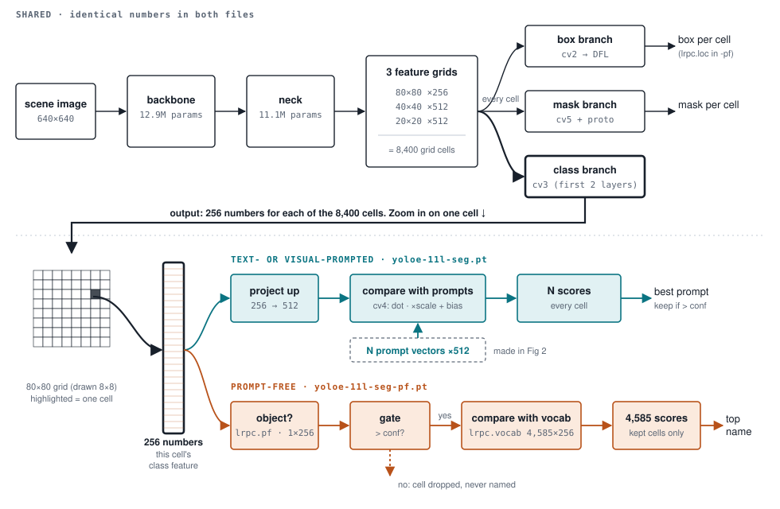
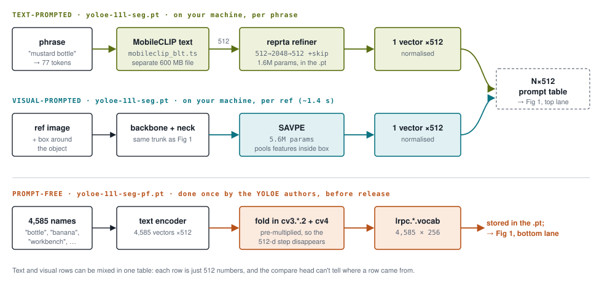
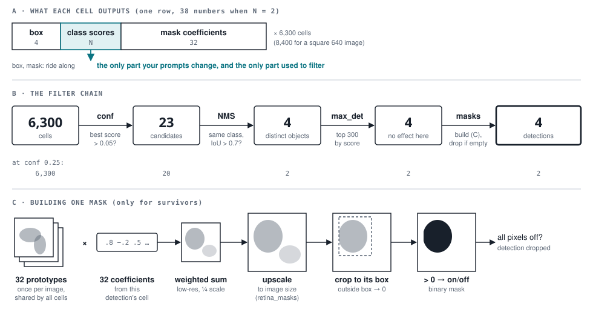

# Stage 1 — YOLOE detection playground

## Commands

Cursor, connected to the workstation. Everything runs there.

**CLI** (terminal: `` Ctrl+` ``)
```bash
source .venv/bin/activate                                           # once per terminal
python pipeline/01_detect.py --text "mustard bottle"                # text prompt
python pipeline/01_detect.py --text "mustard bottle" --text banana  # several classes
python pipeline/01_detect.py --ref 006_mustard_bottle               # visual prompt (ready-made)
python pipeline/01_detect.py --prompt my_obj ref.png 120,80,340,410 # visual prompt (your own)
python pipeline/01_detect.py --prompt-free --conf 0.25              # no prompt
python pipeline/01_detect.py --text "mustard bottle" --imgsz 1280 --tag hi_res
python pipeline/01_detect.py --help
```
Prints a table, saves `output/yoloe/<tag>.png`, opens it as a Cursor tab (refreshes on re-run).

**Notebook** (live sliders)
1. Open `notebooks/yoloe_playground.ipynb`.
2. **Select Kernel** (top right) → **Python Environments** → `.venv`.
3. Click the cell → **Shift+Enter**. Move the sliders.

| Problem | Fix |
|---|---|
| Cell runs, no sliders / image | Laptop can't reach unpkg.com; `.vscode/settings.json` uses jsDelivr. **Ctrl+Shift+P → Developer: Reload Window**. (Output → Jupyter shows `Failed to access CDN`.) |
| Notebook changed on disk, Cursor shows old version | **Ctrl+Shift+P → File: Revert File**, restart kernel. Don't Ctrl+S first (overwrites the new one). |

## Data

Stages 1 and 2 share one scene: `data/multi_object_scene/` (BOP YCB-Video frame, 5 objects).

| Data | File | Used by |
|---|---|---|
| RGB image | `data/multi_object_scene/scene_rgb.png` | stage 1, 2 |
| Depth | `data/multi_object_scene/scene_depth.png` (uint16 × 0.1 mm) | stage 2 |
| Camera intrinsics `K` | `data/multi_object_scene/camera_K.txt` | stage 2 |
| Prompt | text, or example image + box: `data/multi_object_scene/refs/<NAME>.{png,json}` | stage 1 |
| **Mask** | made by stage 1 (YOLOE) | stage 1 → 2 |
| Mesh | `assets/ycb/006_mustard_bottle/textured.obj` | stage 2 |
| **Pose** | made by stage 2 (FoundationPose) | stage 2 |

## Inputs

| Input | CLI | Notebook |
|---|---|---|
| Scene image | `--scene PATH` (default `scene_rgb.png`) | "scene" dropdown / "or path" |
| Text prompt | `--text "name"` (repeat) | comma-separated |
| Visual prompt, ready-made | `--ref NAME` → `refs/NAME.{png,json}` | "ref" |
| Visual prompt, your own | `--prompt NAME IMAGE X0,Y0,X1,Y1` | "own ref": `name \| path \| x0,y0,x1,y1` |
| No prompt | `--prompt-free` | prompt **none** |

- One prompt kind per run.
- Visual prompt = image + pixel box around the object.
- New ready-made ref: `refs/NAME.png` + `refs/NAME.json` (`{"bbox": [x0, y0, x1, y1]}`).

## Model weights

All in `models/` (gitignored), auto-downloaded on first use.

| File | Size | What | Chosen by |
|---|---|---|---|
| `yoloe-11l-seg.pt` | 71 MB | detector + mask head — **default** | `config.yaml` `detect.weights` |
| `yoloe-11s-seg.pt` / `-11m-` | smaller | faster, less accurate | `--weights` / dropdown |
| `yoloe-11{s,m,l}-seg-pf.pt` | 74 MB (l) | prompt-free: same network, built-in 4,585-name vocabulary | `--prompt-free` / prompt **none** |
| `mobileclip_blt.ts` | 600 MB | text encoder, **text prompts only** | automatic |

Prompt-free gives many low scores and generic names ("bottle") → raise `--conf`.

## Knobs

Defaults: `config.yaml` → `detect:`. Flags / notebook controls override per run.

| Knob | Flag | What it does | Try |
|---|---|---|---|
| `weights` | `--weights` | Model size s / m / l | s = faster, l = fewer false positives |
| `conf` | `--conf` | Hide detections below this score (prompt-free: higher = also faster) | 0.05 → 0.3 |
| `iou` | `--iou` | NMS: merge boxes overlapping more than this | 0.3 → 0.9 |
| `imgsz` | `--imgsz` | Inference resolution | 320 / 640 / 1280 |
| `max_det` | `--max-det` | Keep at most N | 1 = best only |
| `half` | `--half` | FP16 | compare speed + scores |

| Action | Time (L40S) |
|---|---|
| Change prompts / weights → rebuild model | 0.5–2 s (mostly loading files) |
| Anything else → predict only | ~17 ms (prompt-free 20–40 ms) |

## Outputs

| Output | CLI | Notebook |
|---|---|---|
| Table: class, score, box, mask px | terminal | under the controls |
| Build time + predict p50 | terminal | under the controls |
| Overlay (masks + boxes + labels) | `output/yoloe/<tag>.png` | live; **save** → same path |
| Settings + detections JSON | — | **save** → `output/yoloe/<tag>.json` |
| Equivalent CLI command | — | under the image |

## How it works

Established from the checkpoints and the ultralytics 8.3.150 code.

**One network.** Prompted and prompt-free weights are identical (backbone, neck, box + mask branches, 33.2M params) except the last class layers.

**Per grid cell.** 80×80 + 40×40 + 20×20 grids = 6,300 cells on this 640×480 scene. Each cell outputs:
`box (4) | class scores (N) | mask coefficients (32)`.


*Top: identical in both weight files. Bottom: one cell's 256-number class feature; prompted compares it with N prompt vectors, prompt-free gates it ("object?") then compares with 4,585 names.*

**A class is a vector.** Class score = cell feature · class vector.

| Mode | Class vector from | Built |
|---|---|---|
| text | phrase → MobileCLIP → 512-d | once per prompt list |
| visual | example image + box → same backbone → pooled → 512-d | once per ref |
| prompt-free | 4,585 names, pre-encoded in the `-pf` file | never (stored) |



- Prompt-free first asks each cell "is it an object?"; only cells above `conf` get named.
- Prompted weights + no prompts → **0 detections, no error**.
- `model.set_classes(...)` + `model.save('x.pt')` bakes the prompts in; reload needs no prompts, no MobileCLIP.

**The prompt only filters.** Every cell predicts a box and mask anyway; the class score decides what survives:



(`--text "mustard bottle" --text banana`.) Masks are built last, for survivors only: 32 shared prototype masks × the detection's 32 coefficients → upscaled → **cropped to its box** → pixels > 0. Empty mask = detection dropped.
